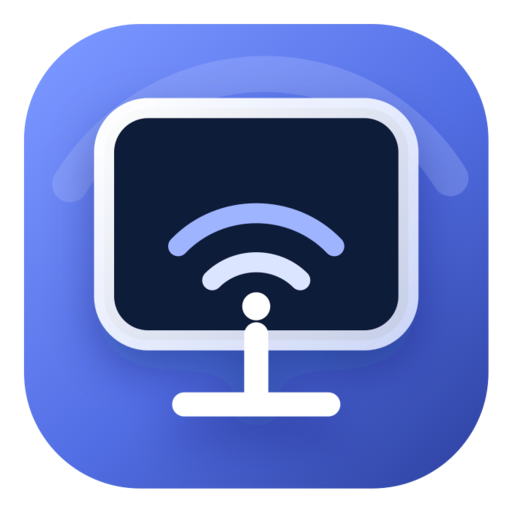

<p align="center">
  
</p>

# UxPlay Studio

Modern, single-window AirPlay screen mirroring, recording, and scene composition for Windows.

UxPlay Studio keeps the receiver, live video, OBS-style sources and layers, recording, projects, settings, activity, and diagnostics in one native Windows app. The mirrored screen is rendered directly into the app through GStreamer's D3D11 video overlay—there is no separate playback window to chase around the desktop.

> [!NOTE]
> UxPlay Studio is an independent open-source project built on [UxPlay](https://github.com/FDH2/UxPlay) and [uxplay-windows](https://github.com/leapbtw/uxplay-windows). It is not affiliated with or endorsed by Apple Inc.

## Highlights

- Embedded AirPlay video in the main app window
- True borderless fullscreen of the composed scene with `F11` and `Esc`; no app chrome or detached window
- Native Studio workspace with source/layer ordering, visibility, locking, multi-selection, and undo/redo
- Stage-first creator interface with one OBS-style canvas workspace, source cards, context menus, and an exact transform inspector
- Direct canvas manipulation: drag, resize, crop with `Alt`, rotate, snap, fit, center, opacity, and masks
- Independent 16:9 Wide and 9:16 Vertical compositions saved in each project, switched with exclusive canvas tabs
- Local crash-recoverable recording with separate direct AirPlay video, system-audio loopback, camera, and microphone tracks
- Live presenter-camera preview rendered directly into the camera scene layer, with no duplicate monitor overlay
- Background MP4 export that applies position, size, crop, arbitrary rotation, opacity, and shape masks
- Bounded asynchronous AirPlay handoff keeps muxing and finalization off the live decode/render path
- First-sample timestamps align independently captured camera, microphone, system audio, and AirPlay video on export
- Local Projects browser with interrupted-session recovery
- Clear receiver states: starting, ready, connecting, sharing, and recovery
- Device, resolution, and session-duration status
- Responsive 1080p60 and busy-Wi-Fi 720p30 low-latency profiles
- Optional four-digit PIN for shared Wi-Fi networks
- Local activity log and copyable diagnostics
- Bonjour and Bluetooth discovery support
- Automatic recovery with capped backoff
- Hardware decode is preferred when available, with automatic software fallback
- Bounded low-latency buffering that drops stale frames instead of falling farther behind
- Portable x64 and ARM64 build pipeline

## Download

Download the latest portable ZIP from [Releases](https://github.com/inspirezuza/uxplay-studio/releases). Extract it and run `uxplay-studio.exe`.

Windows may display a SmartScreen warning because community builds are not code-signed. The complete source and reproducible build workflow are available in this repository.

## Use

1. Connect the Windows PC and iPhone or iPad to the same Wi-Fi network.
2. Start UxPlay Studio and wait for **Ready to mirror**.
3. Open Control Center on the Apple device.
4. Select **Screen Mirroring**, then select the receiver name shown by UxPlay Studio.

The single **Edit layout** workspace combines the live mirror preview and OBS-style scene editor; there is no separate Live page or second monitor. Arrange sources directly on the canvas, use the `16:9` and `9:16` tabs to switch independent compositions, and use right-click menus on the canvas, Sources, Layers, and Projects for contextual actions. Adding or enabling Camera renders its preview in the camera layer, so the canvas remains the source of truth. Recording always creates a new local project under `Videos\UxPlay Studio`; enabling camera or microphone creates independent presenter tracks. Stop recording before exporting, then select **Export MP4**. See the [Studio guide](docs/STUDIO-GUIDE.md) for canvas controls and recovery behavior.

Some managed, hotel, dorm, or guest Wi-Fi networks block multicast DNS or isolate clients. In that case use a network that permits device-to-device traffic, or enable the Bluetooth discovery fallback. A hotspot is not required when normal Wi-Fi permits discovery and local traffic.

## Build from source

Requirements:

- Windows 10 or 11
- [MSYS2](https://www.msys2.org/) at `C:\msys64`
- Native Windows Python 3.14
- Visual Studio Build Tools with the C++ workload
- .NET 8 only when building the MSI

```powershell
git clone https://github.com/inspirezuza/uxplay-studio.git
cd uxplay-studio
.\build.ps1 bootstrap -Architecture x64
.\build.ps1 package -Architecture x64 -SkipInstaller
```

The verified portable ZIP is written to `out\x64\artifacts`. See [the developer guide](docs/DEVELOPERS-GUIDE.md) for x64 and ARM64 details.

On Windows, `.\build.ps1 package -Architecture x64 -SkipBootstrap -SkipInstaller` also refreshes the per-user install at `%LOCALAPPDATA%\UxPlay Studio` and rewrites the Desktop and Start Menu shortcuts to that exact latest executable. Close UxPlay Studio before packaging; use `-SkipLocalInstall` when you only want a portable artifact.

## Architecture

```text
Qt MainWindow
  ├─ Studio
  │    ├─ SceneCanvas + SceneDocument (Wide and Vertical) — the single user-facing preview/editor
  │    ├─ hidden native VideoSurface (HWND) receiver target
  │    └─ Sources, Layers, Record dock
  ├─ Projects / atomic ProjectStore + recovery
  ├─ Activity, Settings, Diagnostics
  ├─ RecordingSession
  │    ├─ bounded encoded-AirPlay handoff → mux worker → 30-second Matroska segments
  │    ├─ independent system-audio, camera, and microphone tracks + measured first-sample offsets
  │    └─ bounded camera preview frames rendered into SceneCanvas layers
  ├─ ExportJob / GStreamer compositor + Cairo masks
  └─ ReceiverEngine state machine
       └─ vendored libuxplay
            └─ GStreamer embedded D3D11 pipeline
                 ├─ decodebin prefers available hardware decode and can fall back to software
                 ├─ 2-frame leaky queue in low-latency modes
                 └─ d3d11upload → d3d11convert → d3d11videosink
                      └─ GstVideoOverlay → VideoSurface HWND
```

`ReceiverEngine` remains the low-latency app-facing seam. The receive callback performs only a bounded, nonblocking encoded-packet handoff; a dedicated worker owns mux writes and finalization. If that queue cannot keep up, Studio reports a failed recording instead of delaying live display or silently corrupting the project. Window movement, fullscreen, page changes, and occlusion never leak into the direct AirPlay media track. The editor receives bounded live/recorded AirPlay and camera preview frames. Project manifest transactions are serialized and written atomically; every recorded track is segmented every 30 seconds, recovery validates usable streams and preserves rejected fragments, and export reapplies offsets measured from each track's first accepted sample. MP4 output is first written as a private `.partial` file and published only after the pipeline completes. Tests cover state/configuration, native ownership, fullscreen restoration, scene transforms and persistence, recovery, asynchronous handoff, pipeline parsing, direct AirPlay muxing, and real masked/cropped MP4 export.

## Privacy and security

UxPlay Studio operates locally. It does not upload screen content, recordings, activity, or diagnostics. Projects are stored under the current user's Videos folder. On a shared network, enable the four-digit AirPlay PIN in Settings. Diagnostics intentionally exclude the PIN.

## Contributing

Bug reports and pull requests are welcome. Read [CONTRIBUTING.md](CONTRIBUTING.md) before submitting a change. Security issues should follow [SECURITY.md](SECURITY.md).

## Credits and license

UxPlay Studio is licensed under the [GNU General Public License v3.0 or later](LICENSE). It contains a vendored, modified copy of UxPlay; upstream attribution and the exact source revision are documented in [NOTICE.md](NOTICE.md) and `libuxplay/UPSTREAM_COMMIT`.
